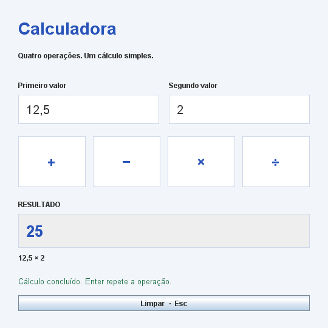
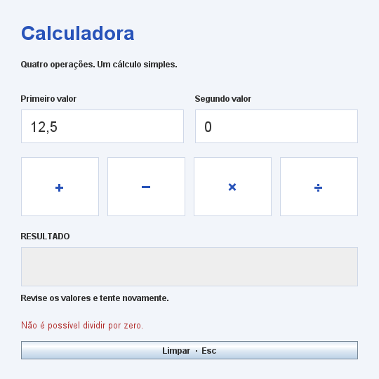

# Calculadora Java

Calculadora desktop em português, desenvolvida com Java e Swing. Permite somar, subtrair, multiplicar e dividir dois valores, com validação de entrada e resultados decimais.



## Funcionalidades

- Quatro operações com números positivos, negativos e decimais.
- Entrada com vírgula ou ponto decimal, sem separadores de milhares.
- Cálculos com `BigDecimal`, evitando a imprecisão de `float` em operações como `0,1 + 0,2`.
- Mensagens para campos vazios, números inválidos e divisão por zero.
- Resultado somente para leitura, com texto selecionável para copiar.
- **Enter** calcula com a última operação escolhida (soma inicialmente); **Esc** limpa os campos.
- Interface com rótulos acessíveis e navegação por teclado.

Divisões usam `MathContext.DECIMAL64`: até 16 algarismos significativos, com arredondamento quando necessário. Soma, subtração e multiplicação preservam a precisão decimal dos valores informados.

## Requisitos

- **JDK 8 ou superior**, com `java`, `javac` e `jar` no `PATH`.
- Ambiente gráfico para abrir a aplicação.
- PowerShell para os comandos abaixo; NetBeans com Ant é uma alternativa.

A aplicação não utiliza bibliotecas externas. Um JRE sozinho executa o JAR, mas não compila o projeto.

## Executar

Na pasta do projeto:

```powershell
./build.ps1 run
```

Preencha os dois valores e clique em **+**, **−**, **×** ou **÷**. Por exemplo, `12,5 × 2` resulta em `25`.

Para gerar um JAR executável:

```powershell
./build.ps1 build
java -jar dist/calculadora.jar
```

No NetBeans, abra a pasta do projeto e execute **Run Project**. A classe principal é `calculadora.App`. Com Ant instalado, `ant jar` gera `dist/calculos.jar`, conforme a configuração do NetBeans; execute-o com `java -jar dist/calculos.jar`.

## Testes

```powershell
./build.ps1 test
```

Os testes não exigem JUnit e verificam as quatro operações, precisão decimal, arredondamento, números negativos, entradas inválidas e divisão por zero. Qualquer falha encerra a execução com erro.


### Estado inicial


### Resultado de um cálculo


### Validação de divisão por zero




## Organização do projeto

```text
src/calculadora/
├── App.java                       # Inicialização da aplicação na thread do Swing
├── model/
│   ├── Calculadora.java            # Validação, operações e formatação decimal
│   └── Operacao.java               # Operações disponíveis
└── ui/
    └── CalculadoraPanel.java       # Interface e eventos
test/calculadora/
└── CalculadoraTest.java            # Testes da lógica de cálculo
tools/Capturas.java                 # Geração das imagens da documentação
docs/screenshots/                   # Capturas versionadas
nbproject/                         # Configuração compartilhada do NetBeans
build.ps1                          # Compilação, execução, testes e capturas
build.xml                          # Entrada de build do NetBeans/Ant
```


